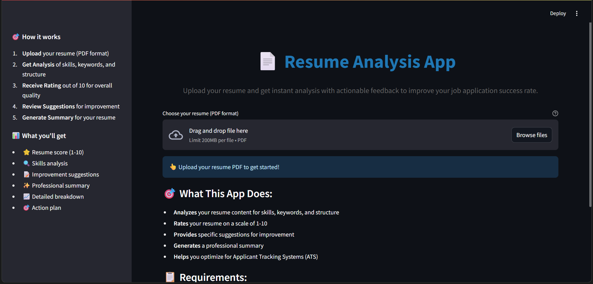
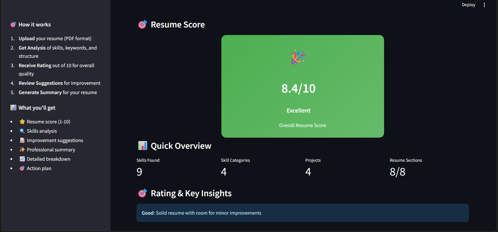
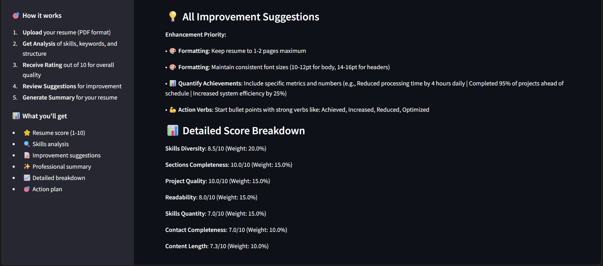
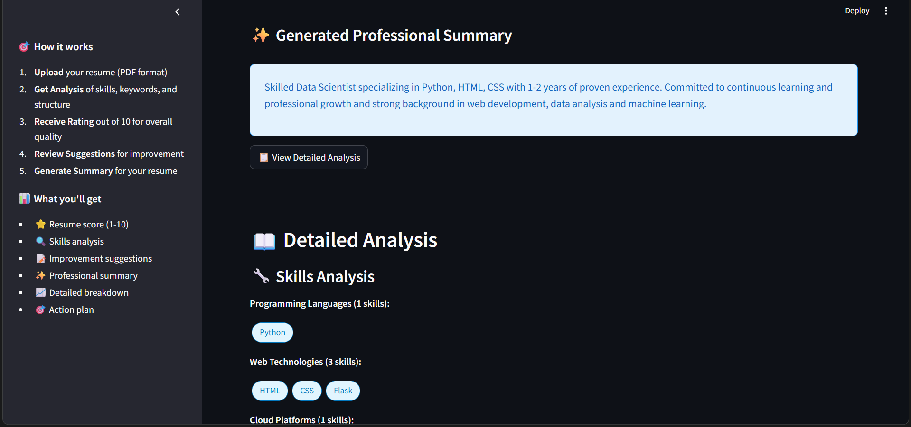

# Resume Analysis App

A comprehensive web application that analyzes resumes and provides actionable feedback to help job seekers improve their chances of landing interviews. Built with Streamlit and powered by advanced NLP algorithms.

## 📸 Screenshots

### Main Interface

*Upload your resume and get instant analysis*

### Resume Analysis Results

*Comprehensive scoring and skills breakdown*

### Improvement Suggestions

*Priority-based recommendations for enhancement*

### Professional Summary

*AI-generated professional summaries*

## ✨ Features

### Core Functionality
- **📄 PDF Upload & Text Extraction**: Robust PDF parsing with multiple fallback methods
- **🔍 Skills & Keywords Analysis**: AI-powered extraction of technical and soft skills
- **⭐ Resume Rating (1-10)**: Multi-criteria scoring system with detailed breakdown
- **💡 Improvement Suggestions**: Priority-based actionable recommendations
- **✨ Professional Summary Generator**: Auto-generate compelling 2-line summaries
- **📊 Detailed Analytics**: Comprehensive analysis with visual insights

### Advanced Features
- **🎯 Multi-Category Skills Detection**: Programming languages, web technologies, databases, cloud platforms, and more
- **📈 Readability Analysis**: Text complexity and sentence structure evaluation
- **🏆 Score Breakdown**: Detailed scoring across 7 different criteria
- **📋 Action Plan**: Structured improvement roadmap with timelines
- **💾 Report Download**: Export detailed analysis as JSON

## 🚀 How to Use

### Step 1: Upload Your Resume
1. Open the application in your browser
2. Click on the file uploader
3. Select your resume PDF file (max 10MB)
4. Wait for the upload confirmation

### Step 2: Get Analysis
The app will automatically:
- Extract text from your PDF
- Analyze skills and keywords
- Calculate your resume score
- Generate improvement suggestions
- Create a professional summary

### Step 3: Review Results
- **Overall Score**: See your resume rating out of 10
- **Skills Analysis**: View detected skills organized by category
- **Suggestions**: Review priority-based improvement recommendations
- **Summary**: Get an AI-generated professional summary

### Step 4: Download Report
- Click "Download Analysis Report" to get a detailed JSON file
- Use the suggestions to improve your resume
- Re-upload to track improvements

## 🛠️ Tech Stack

- **Frontend**: Streamlit (Python web framework)
- **PDF Processing**: PyPDF2, pdfplumber for robust text extraction
- **Text Analysis**: NLTK, TextBlob for natural language processing
- **Data Processing**: Pandas, NumPy for data manipulation
- **UI Components**: Custom CSS for professional styling

## 📦 Installation

### Prerequisites
- Python 3.7+ installed on your system
- pip package manager

### Quick Setup

1. **Clone the repository**:
```bash
git clone https://github.com/007-SARANG/resume-analysis-app.git
cd resume-analysis-app
```

2. **Create virtual environment** (recommended):
```bash
# Windows
python -m venv venv
venv\Scripts\activate

# macOS/Linux
python -m venv venv
source venv/bin/activate
```

3. **Install dependencies**:
```bash
pip install -r requirements.txt
```

4. **Download NLTK data**:
```bash
python -c "import nltk; nltk.download('punkt'); nltk.download('punkt_tab'); nltk.download('stopwords'); nltk.download('averaged_perceptron_tagger'); nltk.download('averaged_perceptron_tagger_eng')"
```

### Running the Application

1. **Start the Streamlit server**:
```bash
streamlit run main_app.py
```

2. **Access the application**:
   - Open your browser and go to `http://localhost:8501`
   - The application will automatically open in your default browser

3. **Upload and analyze**:
   - Upload your resume PDF
   - Get instant analysis and feedback

## 📁 Project Structure

```
resume-analysis-app/
├── main_app.py              # Main Streamlit application
├── src/                     # Core modules
│   ├── pdf_parser.py        # PDF text extraction engine
│   ├── text_analyzer.py     # NLP analysis and skills extraction
│   ├── rating_system.py     # Resume scoring algorithms
│   ├── suggestions.py       # Improvement recommendations engine
│   └── summary_generator.py # Professional summary creation
├── data/                    # Reference databases
│   ├── skills_database.json # Comprehensive skills categorization
│   └── job_keywords.json    # Industry-specific keywords
├── uploads/                 # Temporary file storage
├── screenshots/             # Application screenshots
├── requirements.txt         # Python dependencies
├── .gitignore              # Git ignore rules
└── README.md               # This documentation
```

## 🎯 Analysis Criteria

The app evaluates resumes across 7 key criteria:

1. **Skills Diversity (20%)**: Variety of skill categories
2. **Skills Quantity (15%)**: Total number of skills mentioned
3. **Sections Completeness (15%)**: Presence of essential resume sections
4. **Readability (15%)**: Text clarity and structure
5. **Project Quality (15%)**: Quality of project descriptions
6. **Contact Completeness (10%)**: Complete contact information
7. **Content Length (10%)**: Appropriate resume length

## 💡 Tips for Best Results

### Before Upload
- ✅ Ensure your PDF contains selectable text (not scanned images)
- ✅ Use standard resume formatting
- ✅ Keep file size under 10MB
- ✅ Include all standard sections (experience, education, skills, etc.)

### After Analysis
- 📝 Focus on "Critical Priority" suggestions first
- 🔧 Add skills from missing categories
- 📊 Include quantifiable achievements
- ✨ Use the generated professional summary
- 🔄 Re-analyze after making improvements

## 🐛 Troubleshooting

### Common Issues

**PDF Not Processing**
- Ensure the PDF contains selectable text
- Try a different PDF reader to save/export your resume
- Check file size is under 10MB

**Low Skills Score**
- Add more specific technical skills
- Include tools and technologies you've used
- Organize skills into clear categories

**Missing Sections Warning**
- Add a professional summary/objective
- Include project descriptions
- Ensure all standard sections are present

### Getting Help

If you encounter issues:
1. Check the error messages displayed in the app
2. Ensure all dependencies are installed correctly
3. Verify NLTK data has been downloaded
4. Try with a different PDF file

## 🤝 Contributing

We welcome contributions! Here's how to get started:

1. **Fork the repository**
2. **Create a feature branch**:
   ```bash
   git checkout -b feature/amazing-feature
   ```
3. **Make your changes**
4. **Run tests** (if available)
5. **Commit your changes**:
   ```bash
   git commit -m 'Add amazing feature'
   ```
6. **Push to your branch**:
   ```bash
   git push origin feature/amazing-feature
   ```
7. **Submit a Pull Request**

### Development Guidelines
- Follow PEP 8 style guidelines
- Add docstrings to new functions
- Update tests for new features
- Update documentation as needed

## 📄 License

This project is licensed under the MIT License - see the [LICENSE](LICENSE) file for details.

## 🙏 Acknowledgments

- **NLTK Team** for natural language processing tools
- **Streamlit** for the amazing web framework
- **PyPDF2 & pdfplumber** for PDF processing capabilities
- **TextBlob** for simplified text processing

## 📞 Support

For support, feature requests, or bug reports:
- 📧 Email: your-email@example.com
- 🐛 Issues: [GitHub Issues](https://github.com/yourusername/resume-analysis-app/issues)
- 💬 Discussions: [GitHub Discussions](https://github.com/yourusername/resume-analysis-app/discussions)

---

**Made with ❤️ to help job seekers land their dream jobs!**